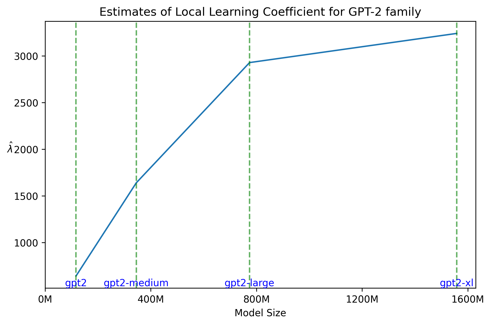
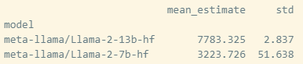

# Task Description
Note: _I have selected the Architectural Comparisons task, but after finishing work and reading the description again I have done something slightly different._

Let's try to estimate local learning coefficient for different sizes of pretrained models from same model families i.e. [gpt2, gpt2-medium, gpt2-large, gpt2-xl].

We assume:
1) pretrained models have reached local minimums
2) they were all trained on the same data
3) larger models should have larger learning coefficient $\lambda$

## Playing with code

### Dataset preparation
To sample loss we will use `imdb` dataset. We will pass part of each review as a input into model and use the next token as a label.  
We don't want to use the whole review - 1 as input and last token as label as there is some potential that last tokens of many reviews will end similarly (e.g. ".") 
We select text which are at least X tokens long and then  use X-1 token as label.  (In this case X should be somehow high as higher context -> better performance). We have selected X=200.

### Running estimator from _devinterp_ library

The estimator seems pretty unstable. We are going to use 2 approaches to stabilize it. First most obvious way would be to play with hyperparameters but let's first try another faster way.

Fast, yet maybe not so robust method to stabilize it is to clip all exploding losses in the chains. We have selected Xth quantile as the maximum value of loss in the chain. In practice this is not enough so we generate a lot of chains and the final average of LLC is taken only over positive estimates which are lower than Yth quantile. Given that we generate enough chains with enough samples this method should be good in terms of not biasing our estimator.
Testing this method it seems that although it helps, it's not sufficient on its own so HP search is needed.

After doing HP search ([`single_model_hp.py`](../single_model_hp.py)) we found out that the most relevant parameter is learning rate, for SLGF other parameters didn't noticeably influence the estimate, while for SHNHT the diffusion factor seemed to change the mean of estimate, with higher values pushing estimate down.
Comparing the stability of estimates produced by SLGD and SGNHT optimizers (by using simple statistic chains_mean/chains_std) we see that SLGD optimizer produces much more stable estimates. Another important observation from HP search is that when parameters are right there are no exploding losses so there is no need for the chain clipping approach. Oh well...

Next problem in `devinterp.slt.sample` function is that the dataset is not being shuffled in between different chain generation, which is a problem as we don't want LLC to be sample dependant. To solve this we generate multiple groups of chains and shuffle the dataset in between each group generation.
Given this setting we can test robustness of the estimator by comparing LLC estimates across different groups, with expectation that it will be stable.

## Model comparison

Having found stable hyperparameters, we assume that they tranfer over models. (We would need to verify this claim, but we are pretty sure of it).
Then we can estimate the LLC for different models from the same model family like GPT2 models. Our hypothesis is that LLC should be higher for larger models as we expect that they perform better, resulting in lower prediction loss.

### GPT2
After running (['estimate_model_family.py](../estimate_model_family.py)) all `gpt2` models on 4 different dataset shuffles we get the following graph.

The plot seems to confirm our hypothesis, it's interesting how the gains in LLC from doubling the model size diminish with every doubling, which pretty much approximates how gpt2 models scale.

### Llama2
Now, for something different, let's try this approach on Llama2 family of models.
Our code needs some modification so we can run experiments with models loaded in quantized states.  
Another potential issue is that the process of loading quantized model can throw our model out of local minimum but let's see.
Unfortunately, we weren't able to load Llama2 70B due to the memory issues so the resulting plot of just 2 model sizes (7B and 13B) wouldn't be that informative. 
Thus we just present the result table of estimating LLC using 3 groups of chains.

We again get results in line with the hypothesis.

# Conclusion
We have shown that the estimator of learning coefficient $\lambda$ a) preserves ordinality b) can be stable in the current LLMs.

One question that we haven't answered is if it makes sense to compare estimates of $\lambda$ across model families.  
We have used the same dataset for both families, which would maybe add some points to the case, but looking at the numbers we are not sure that `gpt2-xl` and `llama-2-7b` should have comparable LLC, given their differences in performance.
